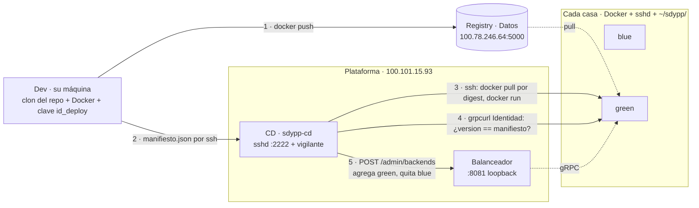
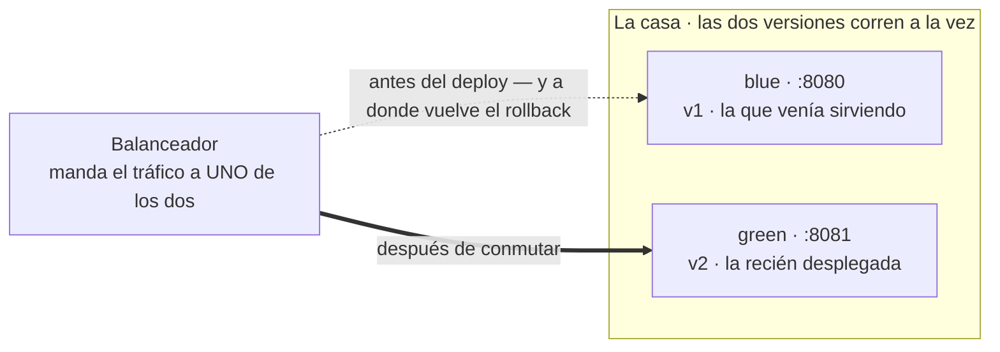

# SDyPP — Servicio Python replicado

Servicio **gRPC** en Python, replicado entre las casas del grupo y desplegado en contenedores.
Réplicas *stateless* detrás del balanceador de Plataforma, estado compartido en Redis y
despliegues que no cortan el servicio.

El contrato con App Java está en **[`CONTRATO.md`](CONTRATO.md)** — ante una diferencia, manda el
contrato, no este README.

> La entrega de la Clase 1 (mini-nube y deploy manual) quedó en el tag **`Entrega-Clase1`**.

## 👥 Integrantes

* **Tomás Resnik** — Legajo 190168
* **Mateo Nomico** — Legajo 168102
* **Salvador Baez** — Legajo 195157

---

## Los RPC

| RPC | Qué hace |
| :--- | :--- |
| `Identidad` | app, lenguaje, equipo, versión, host y arranque |
| `Salud` | chequeo de salud |
| `Echo` | recibe `ping`, responde `pong` |
| `ListarPersonas` | lo guardado, ordenado por `id` |
| `CrearPersona` | alta; el `id` **lo asigna la base** |

Además se expone **`grpc.health.v1.Health`** (el estándar, que consultan el `HEALTHCHECK` del
contenedor y el balanceador) y **reflection**, que permite al verificador del equipo cruzado
probarnos sin tener el `.proto`.

---

## Levantar el entorno local

```bash
mkdir -p logs/app-1 logs/app-2          # antes: si los crea Docker quedan de root
docker build -t sdypp-app-python:local .
docker network create sdypp

docker run -d --name sdypp-redis --network sdypp \
    redis:8-alpine redis-server --appendonly yes

docker run -d --name sdypp-app-1 --network sdypp -p 8101:8080 \
    -e HOST_NAME=casa-tomas-1 -e CASA=casa-tomas \
    -e TP_REDIS_URL=redis://sdypp-redis:6379/0 \
    -v "$PWD/logs/app-1:/app/logs" --stop-timeout 15 sdypp-app-python:local

docker run -d --name sdypp-app-2 --network sdypp -p 8102:8080 \
    -e HOST_NAME=casa-tomas-2 -e CASA=casa-tomas \
    -e TP_REDIS_URL=redis://sdypp-redis:6379/0 \
    -v "$PWD/logs/app-2:/app/logs" --stop-timeout 15 sdypp-app-python:local
```

Probar (con gRPC no alcanza un `curl`):

```bash
python3 app/cliente.py localhost:8101 alta "Ada Lovelace" 100200
python3 app/cliente.py localhost:8102 personas   # el alta la atendió una réplica
                                                 # y la lectura la otra: el dato está
docker rm -f sdypp-app-1 sdypp-app-2 sdypp-redis # bajar todo
```

Sin Docker: `pip install -r requirements.txt -r requirements-build.txt`, generar los stubs con
`python3 -m grpc_tools.protoc -I. --python_out=app --grpc_python_out=app contrato.proto` y
`python3 app/app.py 8080`.

---

## Publicar una versión

**Un comando, desde la máquina del que hizo el cambio.** Construye la imagen, la prueba, la
sube al registry del grupo y le deja un manifiesto al CD. El deploy en las casas lo hace el CD.

```bash
# 1. el cambio, y VERSION = N+1 en app/app.py; commit
# 2.
./deploy/publicar.sh            # construir, probar, subir, avisar
./deploy/publicar.sh --local    # construir y probar; no sube ni avisa
```

### Quién hace qué



`publicar.sh` termina en el paso 2. No espera el deploy: del `manifiesto.json` en adelante es
todo del CD, y se sigue con `docker logs -f sdypp-cd` en Plataforma.

### Qué hace `publicar.sh`

| Paso | Qué | Si falla |
| :--- | :--- | :--- |
| REGISTRY | `curl` al registry. Avisa si ya hay una `v<VERSION>` publicada | aborta antes del build |
| TAG | `v<VERSION>-<commit corto>`, sufijo `-sucio` si hay cambios sin commitear | — |
| BUILD | `docker build` acá, no en el CD: un error de `contrato.proto` revienta en esta terminal | aborta |
| PROBAR | Levanta la imagen sin base, espera `healthy`, y con `grpcurl` verifica que `Identidad.version` sea el `VERSION` del código | aborta: no se publica una imagen que el CD va a rechazar |
| SUBIR | `docker push` y lee el **digest** | aborta |
| MANIFIESTO | `{equipo, imagen, digest, version, commit, publicado_por, publicado_en}` | — |
| AVISAR | `ssh cd "cat > manifiesto.json.tmp && mv … manifiesto.json"`. El `mv` atómico es lo que dispara al CD | aborta: la imagen quedó subida, se puede volver a avisar |

El manifiesto **no lleva la imagen**: lleva su nombre y su digest. El CD hace `docker pull` por
digest en cada casa, así lo que se despliega es exactamente lo que se probó acá, aunque alguien
vuelva a pushear el mismo tag.

Variables, todas con default: `REGISTRY`, `IMAGEN`, `CD_SSH` (alias `cd` de `~/.ssh/config`),
`DIR_ENTRANTE`, `INTENTOS_SALUD`, `ESPERA_SALUD`. El encabezado del script trae el bloque de
`~/.ssh/config` que hace falta.

### Qué hace el CD con el manifiesto

En todas las casas **a la vez**, por SSH: `docker pull` por digest → `docker run` del color que
no está sirviendo → espera `healthy` **y** verifica `Identidad.version` desde afuera. Si **una**
casa no pasa, baja las nuevas en todas y no toca el balanceador: nadie vio la versión rota.
Si pasan todas, **un solo POST** a `/admin/backends` con todas las casas (primero agrega,
después quita) y guarda el estado. La versión vieja no se baja: queda al lado para el rollback,
que es el mismo POST al revés. Los detalles y los comandos exactos están en el repo del CD.

### El blue-green, adentro de una casa

Las dos versiones conviven en la misma máquina, en dos puertos. Desplegar es levantar la que no
está sirviendo; conmutar es mover una flecha.



En la casa de Tomás los puertos son **8090 / 8091**: el 8080 y el 8081 los ocupa el balanceador.

**Por qué un CD central y no un `deploy.sh` por casa.** La primera versión de esta entrega
desplegaba desde cada casa: ninguna casa tenía la llave de otra, pero cuatro máquinas tenían
permiso para conmutar el balanceador, cada una construía su propia imagen (dos casas podían
terminar con imágenes distintas de la misma versión) y el "todas o ninguna" era imposible,
porque cada casa sólo sabía de sí misma. Con el CD la llave hacia las casas existe, pero en
**un** lugar, junto al balanceador; las casas no tienen nada que perder — ni clon del repo, ni
credenciales, ni acceso al balanceador — y la imagen que corre en todas es la misma, por digest.

---

## Levantar tu casa — guía de cero

Para el que pone una casa en el pool. **No hace falta clonar este repo**: la casa sólo necesita
Docker, un `sshd` que acepte la clave del CD, y `~/sdypp/`. Cuatro pasos, cada uno con su
comprobación.

Necesitás dos datos de Tomás, por Discord: **la `TP_REDIS_URL`** (lleva la contraseña de la base)
y **la clave pública del CD** (`id_deploy.pub`).

### 1 · Docker, Tailscale y el registry

```bash
docker ps                               # tiene que andar SIN sudo
tailscale status                        # tu nodo y el de Tomás, en verde
```

Si `docker ps` te pide sudo: `sudo usermod -aG docker "$USER"`, cerrás sesión y volvés a
entrar. El CD corre `docker` por SSH con tu usuario: si le pide sudo, el deploy se cuelga.

El registry del grupo no tiene TLS (el cifrado lo pone Tailscale). Docker se niega a hablarle
salvo que se lo digas:

```bash
sudo tee /etc/docker/daemon.json <<'EOF'
{"insecure-registries": ["100.78.246.64:5000"]}
EOF
sudo systemctl restart docker
docker pull 100.78.246.64:5000/sdypp-app-python:v1-ce2fbe3   # o el tag que esté publicado
```

### 2 · El directorio de la casa

```bash
mkdir -p ~/sdypp/logs/blue ~/sdypp/logs/green    # vos, no Docker: si los crea Docker quedan de root

cat > ~/sdypp/.env <<'EOF'
TP_REDIS_URL=<la línea que te pasó Tomás, tal cual>
EOF
chmod 600 ~/sdypp/.env

cat ~/sdypp/.env                        # que la línea esté completa y sin espacios
```

⚠️ **El nombre no es negociable: exactamente `$HOME/sdypp`.** El CD monta `~/sdypp/.env` con
`--env-file` y `~/sdypp/logs/<color>` como bitácora. Si el `.env` no está ahí, la réplica
arranca sin `TP_REDIS_URL` y las personas dan `UNAVAILABLE`.

Ojo con el formato, que `--env-file` de Docker es literal: `TP_REDIS_URL=redis://…`, **sin
espacios alrededor del `=`** y sin comillas.

### 3 · El firewall

```bash
sudo ufw route allow in  on tailscale0
sudo ufw route allow out on tailscale0
sudo ufw allow in on tailscale0

nc -vz 100.78.246.64 6379               # Redis: succeeded
nc -vz 100.78.246.64 5000               # registry: succeeded
```

⚠️ **Las dos primeras son de `route`, no de `allow`.** Es lo que más tiempo nos costó en toda la
entrega:

| Regla | Cadena | Para qué |
| :--- | :--- | :--- |
| `route allow in` | `FORWARD` | Que el balanceador **entre** a tu contenedor. Un puerto publicado con `-p` no termina en un proceso del host: se le hace DNAT hacia la IP del contenedor, así que pasa por `FORWARD`, no por `INPUT`. |
| `route allow out` | `FORWARD` | Que tu contenedor **salga** hacia Redis y hacia el registry. Ese tráfico va `docker0 → tailscale0`, que también es `FORWARD`. |
| `allow in` | `INPUT` | Que el CD **entre por SSH** a tu máquina. Es el único proceso propio que exponés, y sólo al tailnet. |

Con el `DEFAULT_FORWARD_POLICY="DROP"` que trae ufw, un `ufw allow in ... to any port 8080`
**no sirve para las dos de `FORWARD`**, y el síntoma no apunta al firewall: la app responde
`UNAVAILABLE` como si la base estuviera caída. Ojo también con que `tailscale ping` puede andar
igual — lo contesta `tailscaled` sin pasar por el firewall.

### 4 · La llave del CD

```bash
sudo systemctl enable --now ssh          # o sshd, según la distro
mkdir -p ~/.ssh && chmod 700 ~/.ssh
cat >> ~/.ssh/authorized_keys <<'EOF'
<la id_deploy.pub que te pasó Tomás, una sola línea>
EOF
chmod 600 ~/.ssh/authorized_keys
```

Va en el `authorized_keys` **de tu usuario**, no de root: el CD entra como vos y corre `docker`
con tus permisos. La comprobación la hace Tomás desde Plataforma:
`ssh casa-<vos> docker ps` tiene que responder sin pedir nada.

No hay paso 5. **La réplica la levanta el CD** en el próximo deploy; vos no corrés ningún
`docker run`. Para ver que llegó:

```bash
docker ps                                       # sdypp-blue-app-1 o sdypp-green-app-1
docker logs sdypp-green-app-1 | grep personas   # "base compartida en redis://..."
```

Si la segunda dice *"sin TP_REDIS_URL"*, volvé al paso 2: el `.env` no llegó. La app lo decide
una sola vez al arrancar, así que hace falta otro deploy.

---

## Guía de demo — qué hace cada máquina Python

**Verificación cruzada antes de empezar:** que otra casa corra
`python3 app/cliente.py <tu-ip-de-tailscale>:8080 identidad` y le responda. Si eso anda,
estás en el pool.

### Durante la demo

| Momento | Qué hacer |
| :--- | :--- |
| Todo el tiempo | `docker logs -f sdypp-blue-app-1` proyectado: se ve la bitácora en vivo mientras el verificador dispara requests |
| Reparto | El verificador tira N requests; las respuestas alternan `app:"java"` / `app:"python"` |
| Estado compartido | Un alta por el balanceador y una lectura en la request siguiente: la atiende **la otra** app y el dato está |
| Auditoría | Se elige un alta concreta por su `req=` y se la busca en el log del balanceador (a quién derivó) y en `~/sdypp/logs/<color>/bitacora-*.log` (qué hizo esa réplica) |
| Caída | `docker stop sdypp-blue-app-1` → el balanceador la saca, el pedido que tenía se reasigna (`intentos=a→b` en su bitácora), el loop sigue, las personas siguen estando |
| Deploy | `./deploy/publicar.sh` desde la máquina de un dev; en Plataforma, `docker logs -f sdypp-cd`: pull, run, verify, conmutar, sin perder requests |
| Deploy roto | Se publica una versión que no arranca → el CD la baja en todas las casas y no conmuta |
| Rollback | Desde el CD, `deploy.sh rollback` → vuelve al color anterior en un comando |

### Si algo falla

```bash
docker ps -a                             # ¿está levantado?
docker logs sdypp-blue-app-1 | tail -30  # ¿qué dijo al arrancar?
docker inspect --format '{{.State.Health.Status}}' sdypp-blue-app-1
python3 app/cliente.py localhost:8080 salud
```

Si los RPC de personas responden `UNAVAILABLE`, mirá **el arranque antes que la red**:

```bash
docker logs sdypp-blue-app-1 | grep personas
```

- *"sin TP_REDIS_URL"* → el `--env-file` no llegó. La app lo decide una sola vez al arrancar
  y no reintenta nunca, así que **no alcanza con `docker restart`**: el `--env-file` se lee al
  crear el contenedor. Arreglá `~/sdypp/.env` y pedí otro deploy (o `docker rm -f` y el
  `docker run` de la sección "Levantar el entorno local", con tu `.env`).
- *"base compartida en…"* → ahí sí es red: `sudo ufw route allow out on tailscale0`, y comprobar
  con `nc -vz 100.101.15.93 6379`.

---

## Variables de entorno

| Variable | Para qué | Default |
| :--- | :--- | :--- |
| `PORT` | Puerto de escucha. El primer argumento de CLI le gana. | `8080` |
| `HOST_NAME` | Identidad de la instancia. Da nombre al archivo de bitácora. | *hostname* |
| `CASA` | Nodo donde corre. Segundo campo de la bitácora. | `casa-desconocida` |
| `TP_REDIS_URL` | Base compartida. **Lleva la contraseña: no se versiona.** | vacío → personas da `UNAVAILABLE` |
| `TP_WORKERS` | Hebras que atienden RPCs a la vez. | `10` |
| `TP_LOGS` | Directorio de la bitácora. | `logs` |

---

## Decisiones

**Estado compartido en Redis** (esquema y atomicidad en [CONTRATO.md §4](CONTRATO.md)).
Verificado con 25 altas simultáneas del mismo legajo (1 alta, 24 conflictos) y 40 concurrentes
desde dos réplicas (ids 1 a 40, sin huecos). Sin esa atomicidad haría falta exclusión mutua entre
casas, que es un problema bastante más grande.

**Bitácora al disco local**, un archivo por réplica (formato en [CONTRATO.md §5](CONTRATO.md)).

**Red entre casas: Tailscale.** Un tailnet donde entran todas las casas, así el balanceador, el
CD y el registry se alcanzan sin abrir puertos al mundo. Siempre por **IP** de Tailscale: MagicDNS
no resuelve en todas las máquinas y el síntoma es una réplica que entra al pool y nunca se puede
chequear. Sin TLS en gRPC ni en el registry, a propósito: el cifrado lo pone WireGuard por debajo.

**Registry propio, en la máquina de Datos.** La imagen se construye una vez y todas las casas
bajan la misma, por digest. Se descartó guardarla en Redis (224 MB contra un `maxmemory` de 256,
y acopla el deploy con la base) y un registry por casa (no tiene sentido: una imagen, muchos
lectores).

**Sin archivos de compose.** En la casa corre un contenedor solo: un manifiesto sería una pieza más
que mantener igual en cinco máquinas, y el nombre del contenedor lo derivaba compose distinto según
su versión (`_app_1` en v1, `-app-1` en v2) mientras el CD consulta un nombre exacto.
Ahora lo fija `--name`, y los comandos de desarrollo son los mismos que usa el deploy.

---

## Aportes propios

Tres cosas que el enunciado no pedía y que decidimos poner igual.

### 1 · gRPC + Protobuf en lugar de HTTP/JSON, con reflection

El enunciado fija el contrato en HTTP (`GET /`, `GET /health`, `POST /echo`, `GET|POST /personas`).
Lo reescribimos como cinco RPC sobre un `.proto` compartido con la App Java, y además exponemos
el health estándar `grpc.health.v1.Health` y **server reflection**.

**Por qué.** El contrato deja de ser un README que cada implementación interpreta y pasa a ser un
artefacto que compila: el mismo `.proto` genera los stubs de los dos lados, así que una diferencia
de campos se ve al generar y no en la demo. La reflection es lo que hace posible la regla de que
*la verificación no la hace el dueño*: el equipo cruzado nos prueba con `grpcurl` sin que le
pasemos los stubs. De paso, es el Hit #8 del TP1 adelantado.

**Lo que se paga:** gRPC no viaja sobre HTTP/1.1, así que el balanceador ya no puede ser un proxy
HTTP de cien líneas — las condiciones que le impone están en [CONTRATO.md §7](CONTRATO.md).

### 2 · Graceful shutdown en dos fases, coordinado con el balanceador y con Docker

El enunciado sólo lo *pregunta* («¿cómo se apaga un proceso con dignidad?»). Está implementado, y
el orden de los tres pasos es lo que importa:

| Paso | Qué hace | Por qué en ese orden |
| :--- | :--- | :--- |
| `SIGTERM` → `NOT_SERVING` | `enter_graceful_shutdown()` marca la réplica como no-sana | El balanceador la saca de rotación **antes** de que empiece a drenar; al revés le sigue mandando RPC nuevos mientras se apaga |
| `stop(grace=10)` | Deja de aceptar RPC nuevos y espera a los que están en vuelo | Es lo que evita cortar una request a mitad de camino justo durante el deploy |
| `--stop-timeout 15` | El plazo que Docker le da al contenedor | Tiene que ser **mayor** que el `grace`, o llega el `SIGKILL` en medio del drenado y todo lo anterior no sirvió de nada |

**Por qué.** Son tres timeouts en tres capas distintas —app, balanceador y runtime— y basta con que
uno esté mal ordenado para perder requests en cada deploy. El blue-green del enunciado supone que
bajar la versión vieja es gratis; sin esto, no lo es.

### 3 · Alta atómica en Redis con un script Lua

El enunciado sólo dice que «el `id` lo asigna la base». Metimos las cinco operaciones del alta
—chequear el legajo, `INCR`, `HSET`, `ZADD` y `SET`— en un único script Lua, que Redis corre sin
intercalar comandos de otros clientes.

**Por qué.** Con `INCR` solo alcanza para que los `id` no se pisen, pero no para la unicidad de
legajo: entre «consulto si existe» y «lo escribo» se cuela otra réplica y quedan dos personas con
el mismo legajo. El script cierra esa ventana y resuelve la pregunta 6 del enunciado **sin
exclusión mutua entre casas**, que es un problema bastante más grande.

**Verificado** con 25 altas simultáneas del mismo legajo (1 alta y 24 `ALREADY_EXISTS`) y 40
concurrentes desde dos réplicas (ids 1 a 40, sin huecos).

---

## Mejoras al enunciado

### 1 · La base compartida no tiene dueño ni contrato de esquema

El enunciado dice «levantan un contenedor con una base mínima (la que elijan)… dónde corre y quién
lo opera: lo negocian y lo cuentan». Es el **único componente que no aparece en la tabla de
equipos**, y a la vez el único que dos implementaciones distintas escriben a la vez.

**El problema.** El enunciado especifica el contrato de la *API* (el JSON de `/personas`) pero no el
del *almacenamiento*. Si Java guarda `person:7` y Python `persona:7`, las dos apps cumplen el
contrato al 100% y aun así no encuentran lo del otro — que es justo lo que la demo de la Etapa 2
tiene que mostrar. Lo tuvimos que definir nosotros en [CONTRATO.md §4](CONTRATO.md).

**La mejora.** Pedir el esquema de claves o tablas como entregable explícito, y asignarle dueño a
la base en la tabla de equipos.

### 2 · El plano de control app↔balanceador no está especificado, y bloquea toda la Etapa 1

El enunciado le pide a los equipos de app un `deploy.sh` con blue-green, abort y rollback, cuyo
último paso es «el conmutador cambia»: una llamada al balanceador, que lo escribe **otro equipo**.
No hay contrato para eso — ni cómo se agrega un backend, ni cómo se quita, ni cómo se lista el pool.

**El problema.** El entregable de un equipo depende de una API que el enunciado no menciona y que
otro equipo todavía no diseñó. Terminamos usando `POST /admin/backends`, decidido sobre la marcha;
sin eso, `deploy.sh desplegar` construye, levanta el color nuevo, verifica… y no puede conmutar.

**La mejora.** Fijar ese contrato mínimo —agregar, quitar y listar backend— como pieza previa a las
etapas, con el mismo nivel de detalle con que el enunciado fija el contrato de datos.

### 3 · El formato de bitácora no permite la auditoría que el propio enunciado exige

El enunciado fija cinco campos y después pide «eligen un alta concreta y la rastrean por los
archivos: el log del balanceador dice a quién la derivó, el log de esa casa dice qué hizo».

**El problema.** Con esos cinco campos no se puede. La precisión del formato es de **segundos**, así
que dos altas del mismo segundo son indistinguibles; y los relojes de las casas no están
sincronizados, cosa que el propio picante 8 admite. Falta un **id de correlación** que genere el
balanceador y propague a la réplica. Nosotros lo pedimos en [CONTRATO.md §7](CONTRATO.md) como
metadata `x-request-id`, pero el formato de log **no tiene dónde escribirlo**, así que el cruce
sigue siendo por inspección manual.

**La mejora.** Un sexto campo obligatorio de correlación en el formato. Es una línea de contrato que
convierte la auditoría de «mirar dos archivos y creerse» en un `grep` del mismo id en las dos casas.

### De reserva

**La red entre casas debería ser una Etapa 0 con validación, no un «lo resuelven ustedes».** Fue lo
que más tiempo costó de toda la entrega: las reglas de ufw van en `route` (cadena `FORWARD`) y no en
`allow` (`INPUT`), porque un puerto publicado con `-p` no termina en un proceso del host sino en un
DNAT hacia el contenedor. Y el síntoma no apunta al firewall —la app responde `UNAVAILABLE` como si
la base estuviera caída— mientras `tailscale ping` anda igual, porque lo contesta `tailscaled` sin
pasar por el firewall. El TP3 Parte 0 ya hace exactamente esto con k3s: una checklist verificable
antes de repartir el trabajo.

**El verificador cruzado no tiene criterio de aprobación.** «Dispara N requests, cuenta códigos y
muestra el resultado» no dice qué N, con qué concurrencia, qué se considera aprobado (¿cero
errores?, ¿qué desvío de reparto se tolera?) ni qué protocolo asume del lado del que verifica. *La
demo se mide, no se mira* queda a mitad de camino: se mide, pero nadie fijó cuál es el número que
pasa.

---

## Estado

| | Punto | |
| :--- | :--- | :--- |
| ✅ | Contrato v2.2 y `contrato.proto` | |
| ✅ | Servidor gRPC: cinco RPC + health estándar + reflection | |
| ✅ | Personas sobre Redis con alta atómica | Verificado con altas concurrentes |
| ✅ | Graceful shutdown con drenado | `NOT_SERVING` y espera a los RPC en vuelo |
| ✅ | Bitácora a disco, un archivo por réplica | |
| ✅ | `req=<x-request-id>` en la bitácora | Sigue un pedido reasignado entre casas |
| ✅ | `publicar.sh`: build, prueba, push al registry, manifiesto al CD | Probado end-to-end contra un registry local |
| ⬜ | El deploy desde el CD: pull por digest, blue-green en todas las casas, abort y rollback | Repo del CD |
| ✅ | La conmutación | `POST /admin/backends` del balanceador, sólo desde el CD |
| ✅ | Diagramas del flujo de publicación y del blue-green | Arriba |
| ✅ | Los tres aportes propios | Arriba |
| ✅ | Las tres mejoras al enunciado | Arriba, con dos de reserva |
| ⬜ | El verificador, y a qué equipo verificamos | |
| ⬜ | Diagramas de arquitectura por etapa | |

---

## Preguntas para pensar

**1. Cada componente deja registro de lo que hizo a un archivo en el disco local de su casa — no en la base. ¿Por qué no?**

* **Evitar un punto único de falla (SPOF - Single Point of Failure) y garantizar autonomía:**
  Si la bitácora dependiera de la base de datos centralizada, cualquier caída, saturación o problema de conectividad de la base dejaría al nodo sin la posibilidad de registrar sus eventos o podría bloquear la ejecución normal del servicio. Escribir en el disco local garantiza la **autonomía operativa del componente**, permitiendo que continúe funcionando y auditando acciones independientemente del estado de la base de datos o la red.
* **Buffer de contingencia y persistencia offline:**
  En caso de una desconexión o fallo en la base de datos, el archivo en disco local funciona como un buffer persistente y seguro. Una vez restablecido el enlace o la disponibilidad de la base central, la información registrada en el disco local puede ser sincronizada o procesada en lotes (*batching*) hacia la base de datos sin pérdida de datos.
* **Rendimiento e independencia de la red (I/O local vs. latencia de red):**
  Escribir registros directamente en una base de datos remota por cada petición agrega latencia de red (*Round Trip Time*) y genera contención (bloqueos) en el motor centralizado. Las escrituras en disco local secuencial (*append-only*) son significativamente más rápidas y desacoplan la auditoría del rendimiento directo de la aplicación.

**2. Cuando bajan la versión vieja, ¿qué pasa con una request que estaba a medias? ¿Cómo se apaga un proceso con dignidad?**

* **¿Qué pasa con una request a medias ante un apagado abrupto (`SIGKILL` / `kill -9`)?**
  La conexión TCP subyacente se corta intempestivamente (`RST`), interrumpiendo la petición. El cliente o balanceador recibe un fallo de red (`ECONNRESET` o error `502 Bad Gateway`), pudiendo dejar procesos o datos en estado incompleto e inconsistente.
* **¿Cómo se apaga un proceso con dignidad (*Graceful Shutdown*)?**
  Un proceso se apaga con dignidad cuando intercepta señales de detención (`SIGTERM` o `SIGINT`) y ejecuta un cierre ordenado:
  1. Deja de recibir nuevas conexiones cerrando su socket/puerto de escucha.
  2. Concede un tiempo de tolerancia (*drain timeout*) para finalizar las peticiones que ya estaban en vuelo (*in-flight requests*) y retornar sus respuestas.
  3. Libera conexiones a la base de datos, descriptores de archivos y recursos antes de terminar.
  
  *(Nota: En nuestro caso, en la primera entrega implementamos una mejora de **Graceful Shutdown** verificada con el endpoint `GET /slow` para garantizar despliegues sin downtime ni peticiones abortadas).*

**3. ¿El balanceador se entera de una instancia muerta preguntando o cuando una request falla? ¿Y qué hace con esa request: la tira o la reintenta?**

* **¿Cómo se entera el balanceador?**
  * **Detección pasiva (en la petición):** Se entera en el instante en que una petición falla (*connection refused*, *timeout*, o error `5xx`).
  * **Detección activa (*Health Checks*):** Realiza sondeos periódicos (ej. `GET /health`). Si la instancia no responde tras N reintentos, la marca como *unhealthy* y la remueve del pool activo.
* **¿La tira o la reintenta?**
  * **La reintenta:** Si el balanceador opera con HTTP y la petición es **idempotente** (como `GET`, `PUT`, `DELETE`), o si la falla se produce durante el *handshake* TCP inicial antes de enviar el cuerpo del mensaje, redirige la solicitud a otra instancia sana de forma transparente.
  * **La tira:** Si la petición no es idempotente (como un `POST` que pudo haber empezado a mutar estado) o si la falla ocurre a mitad del stream sin garantías de seguridad, el balanceador cancela la petición y retorna un error `502 Bad Gateway` al cliente para evitar efectos secundarios indeseados.

**4. Si el balanceador atiende con threads, el contador de round-robin es un dato compartido. ¿Qué puede salir mal? ¿Les suena de algún tema de la materia?**

* **¿Qué puede salir mal?**
  Se produce una **Condición de Carrera (*Race Condition*)** o *Data Race* sobre el contador compartido de Round-Robin.
  * **Ejemplo práctico:** Supongamos que el contador `index` vale `0` y existen 3 réplicas (0, 1 y 2). Al ingresar dos peticiones simultáneas atendidas por el Hilo A y el Hilo B:
    1. El Hilo A lee `index` (obtiene `0`).
    2. El Hilo B lee `index` en paralelo (obtiene `0`).
    3. El Hilo A calcula `(0 + 1) % 3 = 1`, envía la petición a la réplica `0` y actualiza `index = 1`.
    4. El Hilo B calcula `(0 + 1) % 3 = 1`, envía la petición a la réplica `0` y actualiza `index = 1`.
    * **Resultado:** Ambas peticiones se derivaron a la réplica `0`, provocando una **actualización perdida (*Lost Update*)** en el contador y salteándose las réplicas `1` y `2`. Esto destruye la distribución equitativa de carga.
* **Tema de la materia:**
  **Control de Concurrencia** (Sección Crítica, Exclusión Mutua con *Locks/Mutexes* o variables atómicas como `AtomicInteger`).

**5. ¿Reenvían la request entendiéndola (HTTP) o pasando bytes (TCP)? ¿Qué cambia?**

* **Balanceo a nivel transporte (TCP / L4):**
  Transfiere streams de bytes puros sin interpretar ni modificar la capa de aplicación HTTP.
  * **Cuándo es mejor usarlo (Ejemplos):** En escenarios que requieran altísimo rendimiento y muy baja latencia, proxies de bases de datos (PostgreSQL/MySQL), streaming de audio/video o protocolos sobre TCP genérico.
* **Balanceo a nivel aplicación (HTTP / L7):**
  Termina la conexión TCP, parsea la petición HTTP (método, URI, encabezados) y abre una nueva conexión hacia la réplica elegida.
  * **Cuándo es mejor usarlo (Ejemplos):** En API Gateways que requieren enrutamiento por rutas de URL (ej. dirigir `/personas` a un grupo de réplicas y `/health` a otro), terminación de certificados SSL/TLS, persistencia de sesión por cookies, o reintentos inteligentes (*failover*) según códigos HTTP de estado.

**6. ¿Por qué las réplicas tienen que ser stateless? ¿Qué se rompe con un contador en memoria o una sesión? ¿A dónde se mudó el estado en esta tarea?**

* **¿Qué es una arquitectura *Stateless* (sin estado)?**
  Es un modelo donde los componentes o réplicas no retienen información ni estado interno sobre transacciones o clientes anteriores. Cada petición recibida se procesa de manera autónoma con los datos que trae la propia solicitud, haciendo que cualquier réplica pueda responder cualquier petición indistintamente.
* **¿Por qué deben ser *stateless* y qué se rompe con estado local (contadores/sesiones en RAM)?**
  * **Se rompe la escalabilidad horizontal y el balanceo:** Si la Réplica A guarda un contador o sesión en su memoria local, una petición subsiguiente dirigida a la Réplica B fallará o devolverá datos inconsistentes.
  * **Se pierde la tolerancia a fallos:** Si una réplica se cae o se reinicia durante un despliegue, todo el estado contenido en su memoria RAM se destruye irremediablemente.
* **¿A dónde se mudó el estado en esta tarea?**
  El estado se extrajo de las réplicas y se mudó a un almacenamiento externo centralizado en **Redis** (`TP_REDIS_URL`).

**7. Dos réplicas hacen POST /personas al mismo tiempo. ¿Quién garantiza que los id no se pisen? ¿Qué problema de la materia les está resolviendo la base sin que lo vean?**

* **¿Quién garantiza que los `id` no se pisen?**
  **Redis**, ejecutando sus comandos y scripts de Lua de forma **monohilo (*single-threaded event loop*)**, lo que garantiza que la generación e incremento de los IDs se ejecuten de manera atómica y estrictamente secuencial.
* **¿Qué problema de la materia les está resolviendo la base sin que lo vean?**
  **Atomicidad**. Redis resuelve la ejecución atómica de las operaciones sin necesidad de que las réplicas coordinen cerrojos explícitos o ejecuten protocolos de consenso distribuido entre sí.

---
