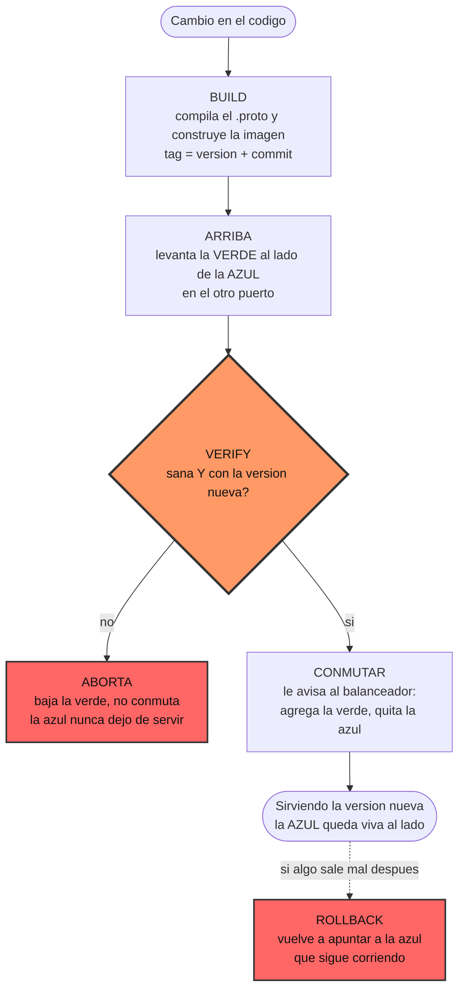

# SDyPP — Servicio Python replicado

Servicio **gRPC** en Python, replicado entre las casas del grupo y desplegado en contenedores.
Réplicas *stateless* detrás del balanceador de Plataforma, estado compartido en Redis y
despliegues que no cortan el servicio.

El contrato con App Java está en **[`CONTRATO.md`](CONTRATO.md)** — ante una diferencia, manda el
contrato, no este README.

> La entrega de la Clase 1 (mini-nube y deploy manual) quedó en el tag **`Entrega-Clase1`**.

## 👥 Integrantes

* **Tomás Resnik** — Legajo 190168
* **Mateo Nomico** — Legajo 168102
* **Salvador Baez** — Legajo 195157

---

## Los RPC

| RPC | Qué hace |
| :--- | :--- |
| `Identidad` | app, lenguaje, equipo, versión, host y arranque |
| `Salud` | chequeo de salud |
| `Echo` | recibe `ping`, responde `pong` |
| `ListarPersonas` | lo guardado, ordenado por `id` |
| `CrearPersona` | alta; el `id` **lo asigna la base** |

Además se expone **`grpc.health.v1.Health`** (el estándar, que consultan el `HEALTHCHECK` del
contenedor y el balanceador) y **reflection**, que permite al verificador del equipo cruzado
probarnos sin tener el `.proto`.

---

## Levantar el entorno local

```bash
mkdir -p logs/app-1 logs/app-2          # antes: si los crea Docker quedan de root
docker build -t sdypp-app-python:local .
docker network create sdypp

docker run -d --name sdypp-redis --network sdypp \
    redis:8-alpine redis-server --appendonly yes

docker run -d --name sdypp-app-1 --network sdypp -p 8101:8080 \
    -e HOST_NAME=casa-tomas-1 -e CASA=casa-tomas \
    -e TP_REDIS_URL=redis://sdypp-redis:6379/0 \
    -v "$PWD/logs/app-1:/app/logs" --stop-timeout 15 sdypp-app-python:local

docker run -d --name sdypp-app-2 --network sdypp -p 8102:8080 \
    -e HOST_NAME=casa-tomas-2 -e CASA=casa-tomas \
    -e TP_REDIS_URL=redis://sdypp-redis:6379/0 \
    -v "$PWD/logs/app-2:/app/logs" --stop-timeout 15 sdypp-app-python:local
```

Probar (con gRPC no alcanza un `curl`):

```bash
python3 app/cliente.py localhost:8101 alta "Ada Lovelace" 100200
python3 app/cliente.py localhost:8102 personas   # el alta la atendió una réplica
                                                 # y la lectura la otra: el dato está
docker rm -f sdypp-app-1 sdypp-app-2 sdypp-redis # bajar todo
```

Sin Docker: `pip install -r requirements.txt -r requirements-build.txt`, generar los stubs con
`python3 -m grpc_tools.protoc -I. --python_out=app --grpc_python_out=app contrato.proto` y
`python3 app/app.py 8080`.

---

## El deploy

**Un script, en la máquina de cada casa.** Cada casa despliega su propia réplica: no hay servidor
de despliegue, no hay SSH y no hay artefactos que viajen por la red.

```bash
./deploy/deploy.sh desplegar   # build, blue-green y conmutación
./deploy/deploy.sh rollback    # vuelve a la versión anterior
./deploy/deploy.sh estado      # qué corre en esta casa
```



**Por qué cada casa despliega la suya.** No es una simplificación: es la decisión de seguridad más
grande del pipeline. Si nadie despliega en la máquina de otro, **ninguna casa necesita tener la
llave de las demás**, y una credencial filtrada no compromete al grupo entero. Lo único que cada
casa expone al tailnet es su réplica.

**La versión vieja no se baja al terminar.** Queda corriendo al lado para que volver atrás sea un
comando y no un deploy en reversa; se baja recién cuando entra una tercera versión.

**El `verify` no se conforma con un `healthy`:** compara la versión contra la que se acaba de
construir. Un build que no rehizo lo que creíamos deja el contenedor sano corriendo la versión
anterior, y sin este chequeo daríamos por bueno un deploy que no cambió nada.

**La casa se anuncia con su IP del tailnet**, que averigua sola con `tailscale ip -4`. Anunciarse
con el nombre de la casa no sirve —no resuelve por DNS— y el síntoma es de los peores: la réplica
entra al pool y el balanceador nunca logra chequearla, aunque esté perfectamente sana.

**Lo que se paga:** como cada casa construye su propia imagen, dos casas pueden terminar con
imágenes distintas de la misma versión (otro pull de la imagen base, otra caché, otro momento). Por
eso el tag lleva el commit: es lo único que después permite comparar de qué fuente salió cada
réplica. Con un servidor de despliegue que reparte una imagen ya armada eso no pasaría — es el
intercambio que elegimos, no un descuido.

### Variables

Todo tiene default; el comando corre sin pasarle nada.

| Variable | Para qué | Default |
| :--- | :--- | :--- |
| `CASA` | Etiqueta de esta casa: sale en la bitácora y nombra el archivo de estado | derivada del hostname |
| `BALANCEADOR` | Plano de control. Sin esto hace todo menos conmutar, y lo dice | vacío |
| `PUERTO_BLUE` / `PUERTO_GREEN` | Los dos puertos del blue-green | `8080` / `8081` |
| `DIR_LOCAL` | El `.env` y las bitácoras de la casa | `~/sdypp` |
| `DIRECCION` | Con qué dirección se anuncia, si `tailscale ip` no sirve | la del tailnet |

---

## Levantar tu réplica — guía de cero

Para el que pone una casa en el pool. **Todos los comandos se corren parado en la raíz de
este repo.** Son cuatro pasos y cada uno termina con su comprobación: si la comprobación
falla, no sigas al siguiente.

Necesitás un solo dato de Tomás, por Discord: **la `TP_REDIS_URL`**, que lleva la contraseña
de la base. Nada más — no hay claves que intercambiar, porque nadie despliega en la máquina
de nadie.

### 1 · Docker y Tailscale

```bash
docker ps                               # tiene que andar SIN sudo
tailscale status                        # tu nodo y el de Tomás, en verde
```

Si `docker ps` te pide sudo: `sudo usermod -aG docker "$USER"`, cerrás sesión y volvés a
entrar. El `deploy.sh` corre `docker` sin `sudo`, así que si te lo pide, el deploy se cuelga
esperando una contraseña que nadie escribe.

### 2 · El directorio de la casa

```bash
mkdir -p ~/sdypp/logs/blue ~/sdypp/logs/green

cat > ~/sdypp/.env <<'EOF'
TP_REDIS_URL=<la línea que te pasó Tomás, tal cual>
EOF
chmod 600 ~/sdypp/.env

cat ~/sdypp/.env                        # que la línea esté completa y sin espacios
```

⚠️ **`~/sdypp/` no es este repo, y el nombre no es negociable.** Son dos carpetas distintas:

| | Qué es | Dónde |
| :--- | :--- | :--- |
| El clon de este repo | El código y el `deploy.sh`. Es desde donde desplegás. | Donde lo hayas clonado |
| `~/sdypp/` | El `.env` con la contraseña y `logs/blue`, `logs/green` | **Exactamente `$HOME/sdypp`** |

`deploy/deploy.sh` toma esa ruta de `DIR_LOCAL` y de ahí saca el `--env-file` y el montaje de
los logs. Si el `.env` no está ahí, **cada deploy** levanta el contenedor sin `TP_REDIS_URL`. Y
vive fuera del repo a propósito: lleva la contraseña.

Ojo con el formato, que `--env-file` de Docker es literal: `TP_REDIS_URL=redis://…`, **sin
espacios alrededor del `=`** y sin comillas. Con un espacio, Docker crea una variable con el
espacio en el nombre y la app no la ve.

### 3 · El firewall

```bash
sudo ufw route allow in  on tailscale0
sudo ufw route allow out on tailscale0

nc -vz <la IP de la casa que corre Redis> 6379    # tiene que decir succeeded
```

⚠️ **Son de `route`, no de `allow`.** Es lo que más tiempo nos
costó en toda la entrega:

| Regla | Cadena | Para qué |
| :--- | :--- | :--- |
| `route allow in` | `FORWARD` | Que el balanceador **entre** a tu contenedor. Un puerto publicado con `-p` no termina en un proceso del host: se le hace DNAT hacia la IP del contenedor, así que pasa por `FORWARD`, no por `INPUT`. |
| `route allow out` | `FORWARD` | Que tu contenedor **salga** hacia Redis. Ese tráfico va `docker0 → tailscale0`, que también es `FORWARD`. |

Las dos son de `FORWARD`, y no hace falta ninguna de `INPUT`: **tu máquina no expone ningún
proceso propio.** Lo único que se alcanza desde afuera es el contenedor de la réplica.

Con el `DEFAULT_FORWARD_POLICY="DROP"` que trae ufw, un `ufw allow in ... to any port 8080`
**no sirve para ninguna de las dos cosas**, y el síntoma no apunta al firewall: la app
responde `UNAVAILABLE` como si la base estuviera caída. Ojo también con que `tailscale ping`
puede andar igual — lo contesta `tailscaled` sin pasar por el firewall.

### 4 · Levantar la réplica

Un comando. Construye la imagen, la levanta, espera a que se declare sana, verifica que sea la
versión que acabás de construir y recién ahí le avisa al balanceador.

```bash
CASA=casa-<tunombre> BALANCEADOR=http://100.101.15.93:8081 ./deploy/deploy.sh desplegar
```

Y las dos comprobaciones que dicen que estás realmente en el pool:

```bash
./deploy/deploy.sh estado
docker logs sdypp-green-app-1 | grep personas   # "base compartida en redis://..."
```

Si la segunda dice *"sin TP_REDIS_URL"*, volvé al paso 2: el `.env` no llegó. Ojo que la app
lo decide una sola vez al arrancar y no reintenta, así que hay que volver a desplegar.

De ahí en más, cada versión nueva es el mismo comando: cambiás `VERSION` en `app/app.py` y
volvés a correr `desplegar`. Alterna solo entre azul y verde.

**Avisá por Discord recién cuando las dos den bien.** Tomás no puede levantar el balanceador
hasta que las réplicas estén.

---

## Guía de demo — qué hace cada máquina Python

**Verificación cruzada antes de empezar:** que otra casa corra
`python3 app/cliente.py <tu-ip-de-tailscale>:8080 identidad` y le responda. Si eso anda,
estás en el pool.

### Durante la demo

| Momento | Qué hacer |
| :--- | :--- |
| Todo el tiempo | `docker logs -f sdypp-blue-app-1` proyectado: se ve la bitácora en vivo mientras el verificador dispara requests |
| Reparto | El verificador tira N requests; las respuestas alternan `app:"java"` / `app:"python"` |
| Estado compartido | Un alta por el balanceador y una lectura en la request siguiente: la atiende **la otra** app y el dato está |
| Auditoría | Se elige un alta concreta y se la busca en el log del balanceador (a quién derivó) y en `~/sdypp/logs/<color>/bitacora-*.log` (qué hizo esa réplica) |
| Caída | `docker stop sdypp-blue-app-1` → sale de rotación, el loop sigue, las personas siguen estando |
| Deploy | Se publica una versión nueva y se ve el blue-green sin perder requests |
| Deploy roto | Se publica una versión que no arranca → aborta y no conmuta |
| Rollback | `./deploy.sh rollback ...` → vuelve al color anterior en un comando |

### Si algo falla

```bash
docker ps -a                             # ¿está levantado?
docker logs sdypp-blue-app-1 | tail -30  # ¿qué dijo al arrancar?
docker inspect --format '{{.State.Health.Status}}' sdypp-blue-app-1
python3 app/cliente.py localhost:8080 salud
```

Si los RPC de personas responden `UNAVAILABLE`, mirá **el arranque antes que la red**:

```bash
docker logs sdypp-blue-app-1 | grep personas
```

- *"sin TP_REDIS_URL"* → el `--env-file` no llegó. La app lo decide una sola vez al arrancar
  y no reintenta nunca, así que **no alcanza con `docker restart`**: el `--env-file` se lee al
  crear el contenedor. Hay que `docker rm -f` y volver a correr el `docker run`.
- *"base compartida en…"* → ahí sí es red: `sudo ufw route allow out on tailscale0`, y comprobar
  con `nc -vz 100.101.15.93 6379`.

---

## Variables de entorno

| Variable | Para qué | Default |
| :--- | :--- | :--- |
| `PORT` | Puerto de escucha. El primer argumento de CLI le gana. | `8080` |
| `HOST_NAME` | Identidad de la instancia. Da nombre al archivo de bitácora. | *hostname* |
| `CASA` | Nodo donde corre. Segundo campo de la bitácora. | `casa-desconocida` |
| `TP_REDIS_URL` | Base compartida. **Lleva la contraseña: no se versiona.** | vacío → personas da `UNAVAILABLE` |
| `TP_WORKERS` | Hebras que atienden RPCs a la vez. | `10` |
| `TP_LOGS` | Directorio de la bitácora. | `logs` |

---

## Decisiones

**Estado compartido en Redis** (esquema y atomicidad en [CONTRATO.md §4](CONTRATO.md)).
Verificado con 25 altas simultáneas del mismo legajo (1 alta, 24 conflictos) y 40 concurrentes
desde dos réplicas (ids 1 a 40, sin huecos). Sin esa atomicidad haría falta exclusión mutua entre
casas, que es un problema bastante más grande.

**Bitácora al disco local**, un archivo por réplica (formato en [CONTRATO.md §5](CONTRATO.md)).

**Red entre casas: Tailscale.** Un tailnet donde entran las tres casas, así el balanceador alcanza
las réplicas por nombre sin abrir puertos al mundo. ngrok queda sólo para exponer el balanceador.

**Sin archivos de compose.** En la casa corre un contenedor solo: un manifiesto sería una pieza más
que mantener igual en cinco máquinas, y el nombre del contenedor lo derivaba compose distinto según
su versión (`_app_1` en v1, `-app-1` en v2) mientras el `deploy.sh` consulta un nombre exacto.
Ahora lo fija `--name`, y los comandos de desarrollo son los mismos que usa el deploy.

---

## Estado

| | Punto | |
| :--- | :--- | :--- |
| ✅ | Contrato v2.2 y `contrato.proto` | |
| ✅ | Servidor gRPC: cinco RPC + health estándar + reflection | |
| ✅ | Personas sobre Redis con alta atómica | Verificado con altas concurrentes |
| ✅ | Graceful shutdown con drenado | `NOT_SERVING` y espera a los RPC en vuelo |
| ✅ | Bitácora a disco, un archivo por réplica | |
| ✅ | `deploy.sh`: build, blue-green, abort y rollback, sin SSH | Probado end-to-end contra el balanceador |
| ✅ | La conmutación | `POST /admin/backends` del balanceador |
| ✅ | Diagrama de flujo del deploy | Arriba |
| ⬜ | Los tres aportes propios | Los de la Clase 1 salieron del proyecto |
| ⬜ | Las tres mejoras al enunciado | |
| ⬜ | El verificador, y a qué equipo verificamos | |
| ⬜ | Diagramas de arquitectura por etapa | |

---

## Preguntas para pensar

**1. Cada componente deja registro de lo que hizo a un archivo en el disco local de su casa — no en la base. ¿Por qué no?**

* **Evitar un punto único de falla (SPOF - Single Point of Failure) y garantizar autonomía:**
  Si la bitácora dependiera de la base de datos centralizada, cualquier caída, saturación o problema de conectividad de la base dejaría al nodo sin la posibilidad de registrar sus eventos o podría bloquear la ejecución normal del servicio. Escribir en el disco local garantiza la **autonomía operativa del componente**, permitiendo que continúe funcionando y auditando acciones independientemente del estado de la base de datos o la red.
* **Buffer de contingencia y persistencia offline:**
  En caso de una desconexión o fallo en la base de datos, el archivo en disco local funciona como un buffer persistente y seguro. Una vez restablecido el enlace o la disponibilidad de la base central, la información registrada en el disco local puede ser sincronizada o procesada en lotes (*batching*) hacia la base de datos sin pérdida de datos.
* **Rendimiento e independencia de la red (I/O local vs. latencia de red):**
  Escribir registros directamente en una base de datos remota por cada petición agrega latencia de red (*Round Trip Time*) y genera contención (bloqueos) en el motor centralizado. Las escrituras en disco local secuencial (*append-only*) son significativamente más rápidas y desacoplan la auditoría del rendimiento directo de la aplicación.

**2. Cuando bajan la versión vieja, ¿qué pasa con una request que estaba a medias? ¿Cómo se apaga un proceso con dignidad?**

* **¿Qué pasa con una request a medias ante un apagado abrupto (`SIGKILL` / `kill -9`)?**
  La conexión TCP subyacente se corta intempestivamente (`RST`), interrumpiendo la petición. El cliente o balanceador recibe un fallo de red (`ECONNRESET` o error `502 Bad Gateway`), pudiendo dejar procesos o datos en estado incompleto e inconsistente.
* **¿Cómo se apaga un proceso con dignidad (*Graceful Shutdown*)?**
  Un proceso se apaga con dignidad cuando intercepta señales de detención (`SIGTERM` o `SIGINT`) y ejecuta un cierre ordenado:
  1. Deja de recibir nuevas conexiones cerrando su socket/puerto de escucha.
  2. Concede un tiempo de tolerancia (*drain timeout*) para finalizar las peticiones que ya estaban en vuelo (*in-flight requests*) y retornar sus respuestas.
  3. Libera conexiones a la base de datos, descriptores de archivos y recursos antes de terminar.
  
  *(Nota: En nuestro caso, en la primera entrega implementamos una mejora de **Graceful Shutdown** verificada con el endpoint `GET /slow` para garantizar despliegues sin downtime ni peticiones abortadas).*

**3. ¿El balanceador se entera de una instancia muerta preguntando o cuando una request falla? ¿Y qué hace con esa request: la tira o la reintenta?**

* **¿Cómo se entera el balanceador?**
  * **Detección pasiva (en la petición):** Se entera en el instante en que una petición falla (*connection refused*, *timeout*, o error `5xx`).
  * **Detección activa (*Health Checks*):** Realiza sondeos periódicos (ej. `GET /health`). Si la instancia no responde tras N reintentos, la marca como *unhealthy* y la remueve del pool activo.
* **¿La tira o la reintenta?**
  * **La reintenta:** Si el balanceador opera con HTTP y la petición es **idempotente** (como `GET`, `PUT`, `DELETE`), o si la falla se produce durante el *handshake* TCP inicial antes de enviar el cuerpo del mensaje, redirige la solicitud a otra instancia sana de forma transparente.
  * **La tira:** Si la petición no es idempotente (como un `POST` que pudo haber empezado a mutar estado) o si la falla ocurre a mitad del stream sin garantías de seguridad, el balanceador cancela la petición y retorna un error `502 Bad Gateway` al cliente para evitar efectos secundarios indeseados.

**4. Si el balanceador atiende con threads, el contador de round-robin es un dato compartido. ¿Qué puede salir mal? ¿Les suena de algún tema de la materia?**

* **¿Qué puede salir mal?**
  Se produce una **Condición de Carrera (*Race Condition*)** o *Data Race* sobre el contador compartido de Round-Robin.
  * **Ejemplo práctico:** Supongamos que el contador `index` vale `0` y existen 3 réplicas (0, 1 y 2). Al ingresar dos peticiones simultáneas atendidas por el Hilo A y el Hilo B:
    1. El Hilo A lee `index` (obtiene `0`).
    2. El Hilo B lee `index` en paralelo (obtiene `0`).
    3. El Hilo A calcula `(0 + 1) % 3 = 1`, envía la petición a la réplica `0` y actualiza `index = 1`.
    4. El Hilo B calcula `(0 + 1) % 3 = 1`, envía la petición a la réplica `0` y actualiza `index = 1`.
    * **Resultado:** Ambas peticiones se derivaron a la réplica `0`, provocando una **actualización perdida (*Lost Update*)** en el contador y salteándose las réplicas `1` y `2`. Esto destruye la distribución equitativa de carga.
* **Tema de la materia:**
  **Control de Concurrencia** (Sección Crítica, Exclusión Mutua con *Locks/Mutexes* o variables atómicas como `AtomicInteger`).

**5. ¿Reenvían la request entendiéndola (HTTP) o pasando bytes (TCP)? ¿Qué cambia?**

* **Balanceo a nivel transporte (TCP / L4):**
  Transfiere streams de bytes puros sin interpretar ni modificar la capa de aplicación HTTP.
  * **Cuándo es mejor usarlo (Ejemplos):** En escenarios que requieran altísimo rendimiento y muy baja latencia, proxies de bases de datos (PostgreSQL/MySQL), streaming de audio/video o protocolos sobre TCP genérico.
* **Balanceo a nivel aplicación (HTTP / L7):**
  Termina la conexión TCP, parsea la petición HTTP (método, URI, encabezados) y abre una nueva conexión hacia la réplica elegida.
  * **Cuándo es mejor usarlo (Ejemplos):** En API Gateways que requieren enrutamiento por rutas de URL (ej. dirigir `/personas` a un grupo de réplicas y `/health` a otro), terminación de certificados SSL/TLS, persistencia de sesión por cookies, o reintentos inteligentes (*failover*) según códigos HTTP de estado.

**6. ¿Por qué las réplicas tienen que ser stateless? ¿Qué se rompe con un contador en memoria o una sesión? ¿A dónde se mudó el estado en esta tarea?**

* **¿Qué es una arquitectura *Stateless* (sin estado)?**
  Es un modelo donde los componentes o réplicas no retienen información ni estado interno sobre transacciones o clientes anteriores. Cada petición recibida se procesa de manera autónoma con los datos que trae la propia solicitud, haciendo que cualquier réplica pueda responder cualquier petición indistintamente.
* **¿Por qué deben ser *stateless* y qué se rompe con estado local (contadores/sesiones en RAM)?**
  * **Se rompe la escalabilidad horizontal y el balanceo:** Si la Réplica A guarda un contador o sesión en su memoria local, una petición subsiguiente dirigida a la Réplica B fallará o devolverá datos inconsistentes.
  * **Se pierde la tolerancia a fallos:** Si una réplica se cae o se reinicia durante un despliegue, todo el estado contenido en su memoria RAM se destruye irremediablemente.
* **¿A dónde se mudó el estado en esta tarea?**
  El estado se extrajo de las réplicas y se mudó a un almacenamiento externo centralizado en **Redis** (`TP_REDIS_URL`).

**7. Dos réplicas hacen POST /personas al mismo tiempo. ¿Quién garantiza que los id no se pisen? ¿Qué problema de la materia les está resolviendo la base sin que lo vean?**

* **¿Quién garantiza que los `id` no se pisen?**
  **Redis**, ejecutando sus comandos y scripts de Lua de forma **monohilo (*single-threaded event loop*)**, lo que garantiza que la generación e incremento de los IDs se ejecuten de manera atómica y estrictamente secuencial.
* **¿Qué problema de la materia les está resolviendo la base sin que lo vean?**
  **Atomicidad**. Redis resuelve la ejecución atómica de las operaciones sin necesidad de que las réplicas coordinen cerrojos explícitos o ejecuten protocolos de consenso distribuido entre sí.

---
