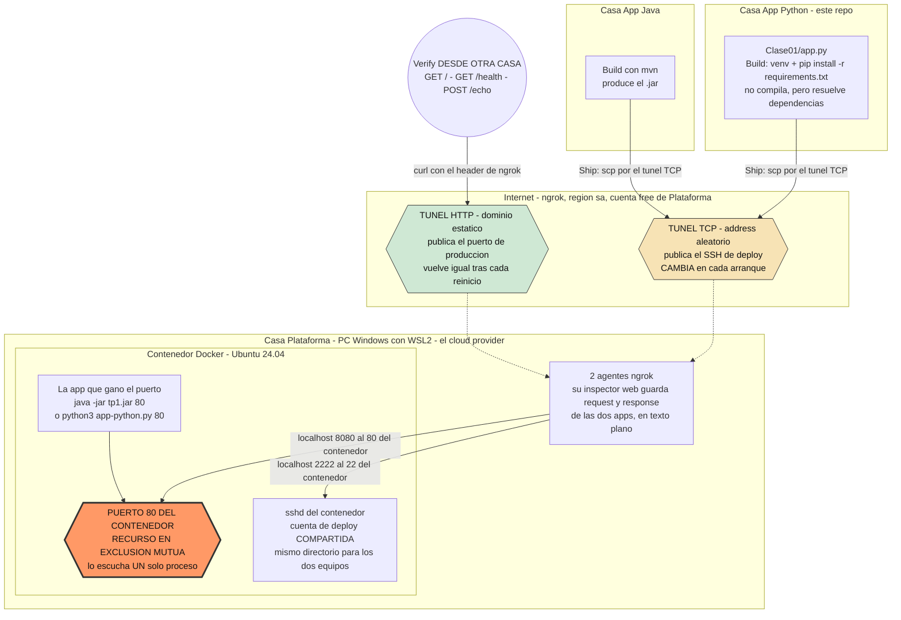
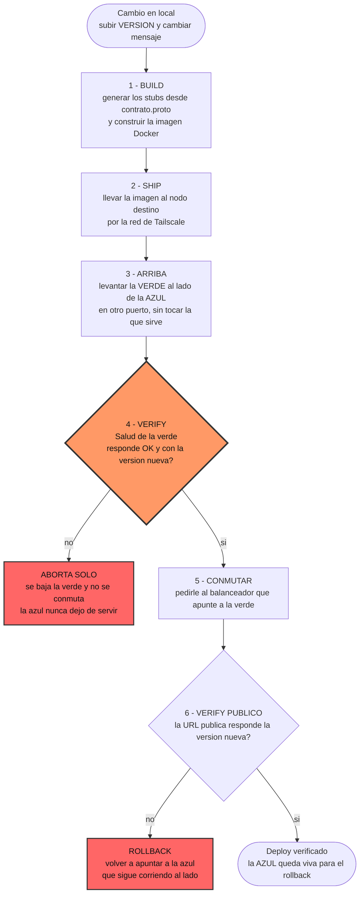

# Sistemas Distribuidos y Programación Paralela (SDyPP) - Mini-Nube

Servicio **gRPC** en Python, replicado entre las casas del grupo y desplegado en contenedores.
Nació como un servidor HTTP para el deploy manual de la Clase 1; en la Clase 2 pasó a ser un
servicio distribuido: réplicas *stateless* detrás de un balanceador, estado compartido en una base
y despliegues que no cortan el servicio.

---

## 👥 Integrantes del Equipo
* **Tomás Resnik** — Legajo 190168
* **Mateo Nomico** — Legajo 168102
* **Salvador Baez** — Legajo 195157

---

## Comandos

Todo el servicio se levanta con Docker. Desde la raíz del repositorio:

```bash
# El directorio de la bitácora se crea ANTES: si lo crea Docker queda de root
# y el proceso, que corre sin privilegios, no puede escribir adentro.
mkdir -p logs/app-1 logs/app-2

docker compose up --build -d
docker compose ps          # las dos réplicas y la base tienen que quedar (healthy)
```

Quedan levantados tres contenedores: la base compartida y **dos réplicas** de la app, en los
puertos `8101` y `8102`. Para bajar todo:

```bash
docker compose down          # conserva los datos de la base
docker compose down -v       # los borra también
```

### Sin Docker

Hace falta generar antes los stubs de Protobuf, que no se versionan porque son producto del build:

```bash
python3 -m venv .venv
source .venv/bin/activate          # Linux / macOS
# .venv\Scripts\Activate.ps1       # Windows (PowerShell)
# .venv\Scripts\activate.bat       # Windows (cmd)

pip install -r requirements.txt -r requirements-build.txt
python3 -m grpc_tools.protoc -I. --python_out=Clase01 --grpc_python_out=Clase01 contrato.proto

python3 Clase01/app.py 8080
```

### Probar una réplica

Con gRPC ya no alcanza un `curl`: el cliente necesita los stubs. Para eso está `cliente.py`:

```bash
python3 Clase01/cliente.py localhost:8101 identidad
python3 Clase01/cliente.py localhost:8101 salud
python3 Clase01/cliente.py localhost:8101 alta "Ada Lovelace" 100200
python3 Clase01/cliente.py localhost:8102 personas      # el alta la atendió una réplica
                                                        # y la lectura la otra: el dato está
```

El servidor también expone **reflection**, así que se lo puede llamar sin tener el `.proto`:

```bash
grpcurl -plaintext localhost:8101 list
grpcurl -plaintext localhost:8101 sdypp.Servicio/Identidad
```

---

## 🚀 Los RPC del servicio

El esquema formal está en **[`contrato.proto`](contrato.proto)**; las reglas que el `.proto` no
puede expresar —validación, orden de los chequeos, semántica de los errores— están en
**[`CONTRATO.md`](CONTRATO.md) v2.0**. Ante una diferencia, **manda el contrato**, no este README.

| RPC | Qué hace |
| :--- | :--- |
| `Identidad` | Metadatos de la instancia: app, lenguaje, equipo, versión, host y arranque. |
| `Salud` | Chequeo de salud del servicio. |
| `Echo` | Recibe `ping` y responde `pong`, con `servido_por` y `version`. |
| `Lenta` | RPC deliberadamente lento (4 s) para probar el **graceful shutdown** y el deploy sin downtime. |
| `ListarPersonas` | Lo guardado en la base compartida, ordenado por `id`. |
| `CrearPersona` | Alta. El `id` **lo asigna la base**, nunca la app. |

Además del RPC `Salud` del contrato se expone **`grpc.health.v1.Health`**, el health checking
estándar: es lo que consultan el `HEALTHCHECK` del contenedor y el balanceador.

---

## 🏗️ Diagrama de Arquitectura

> Éste es el de la **Clase 1**: las tres casas contra un servidor compartido, con el puerto
> como recurso en exclusión mutua. Los de la Clase 2 —uno por etapa, con el balanceador, las
> réplicas y la base— están pendientes.

Tres casas, ninguna en la misma red, coordinadas por Meet/Discord. El equipo **Plataforma** monta
el servidor y reparte el acceso; **App Java** y **App Python** compiten por el mismo puerto de
producción, que es el recurso compartido en exclusión mutua.

El servidor no es una máquina expuesta a internet: es un **contenedor Docker con Ubuntu 24.04
dentro de WSL2**, en una PC hogareña detrás de NAT. Plataforma la hace alcanzable con **dos
túneles de ngrok** — uno publica el HTTP de producción, el otro publica el SSH de deploy.



**Qué expone cada nodo:**

- **Plataforma** expone dos cosas y ninguna es la máquina en sí: el **HTTP de producción** por el
  túnel de dominio estático, y el **acceso de deploy** (SSH) por el túnel TCP. Son los árbitros del
  recurso: si apagan un agente, el equipo que dependía de ese túnel queda afuera.
- **App Java / App Python** no exponen nada hacia afuera. Despliegan *sobre* el nodo de Plataforma,
  no corren servidor propio.
- **Recurso compartido y disputado**: el puerto `80` del contenedor (publicado como el `8080` del host). Un puerto TCP lo escucha un
  solo proceso a la vez, así que desplegar no es "instalar al lado": es un **traspaso**.

**Asimetría entre los dos túneles.** El de producción usa un dominio estático y sobrevive a los
reinicios; el de SSH recibe un address aleatorio y **cambia cada vez que Plataforma lo levanta**.
En la práctica eso significa que el canal de deploy se rompe solo y hay que pedir el puerto nuevo,
mientras que la URL que ve el mundo se mantiene.

**Lo que el diagrama deja ver sobre seguridad.** Todo el tráfico de las dos apps pasa por los
agentes de ngrok de Plataforma, cuyo inspector guarda request y response completos en texto plano.
Y el acceso de deploy es una **cuenta de sistema compartida**: no hay forma de distinguir quién
frenó qué proceso.

---

---

## 🔄 El pipeline (Build → Ship → Arriba → Verify)



**La versión vieja no se baja al terminar el deploy.** Queda corriendo al lado para que volver
atrás sea un comando y no un deploy completo en reversa; se baja recién cuando entra una tercera
versión. Eso implica dos procesos vivos por réplica, y es a propósito.

> ⚠️ El paso 5 depende de una interfaz con el balanceador de Plataforma que **todavía no está
> definida**: cómo se le pide que cambie de destino. El `deploy.sh` lo aísla en una función para
> poder escribir todo lo demás mientras tanto.

---

## 🌟 Aportes Propios Justificados

> ℹ️ **Ninguno de los tres entró al contrato común.** `Lenta` sí, porque las dos apps la necesitan
> para probar el drenado. El **checksum** y el **rate limiting** quedaron afuera porque App Java no
> los tiene: con el balanceador repartiendo entre las dos, el servicio respondería distinto según
> quién atendió. Siguen en el código detrás de un interruptor, **apagados por defecto**:
>
> ```bash
> TP_CHECKSUM=on TP_RATE_LIMIT=on python3 Clase01/app.py 8080
> ```

---

### Aporte 1: Graceful Shutdown & Drenado de RPCs

#### ¿En qué consiste?

Un manejador de `SIGTERM` y `SIGINT` que apaga el servidor en dos tiempos, en vez de morirse de
golpe:

1. **Se declara `NOT_SERVING`** en el health checking estándar. El balanceador lo ve en su próximo
   chequeo y la saca de rotación: deja de mandarle RPCs nuevos *mientras todavía está atendiendo
   los que tiene*.
2. **`server.stop(grace=10)`**: deja de aceptar RPCs nuevos y espera hasta 10 segundos a que
   terminen los que están en vuelo.
3. Recién ahí libera el puerto y termina el proceso.

El orden importa: sin el paso 1, el balanceador sigue derivando peticiones a una réplica que ya
está cerrando, y esas fallan.

#### ¿Cómo probarlo?

```bash
# 1. Lanzar un RPC lento (tarda 4 segundos)
python3 Clase01/cliente.py localhost:8101 lenta &

# 2. Dentro de esos 4 segundos, mandarle SIGTERM al contenedor
docker compose stop app-1
```

**Resultado:** el cliente **no se corta**. Espera sus 4 segundos y recibe la respuesta completa.
En el log del contenedor:

```text
[Lenta] procesando (4 segundos)...
[ Graceful Shutdown ] Recibida SIGTERM. Marcando NOT_SERVING y drenando...
2026-09-06T18:04:30-03:00 | python@casa-tomas | Lenta | OK | -
[ Graceful Shutdown ] Puerto liberado y servidor detenido exitosamente.
```

El `stop_grace_period` del compose está en 15 s **a propósito**: tiene que ser mayor que los 4 s de
`Lenta` más el margen del servidor, o Docker manda `SIGKILL` en medio del drenado y todo esto no
sirve de nada.

---

### Aporte 2: Hash de Integridad del Código en Tiempo de Ejecución (SHA-256)

#### ¿En qué consiste?

Al arrancar, la aplicación lee su propio archivo fuente, calcula su SHA-256 con `hashlib` y lo
informa. Con `TP_CHECKSUM=on` lo imprime en el banner de arranque.

#### ¿Para qué sirve, ahora que hay réplicas?

Dos réplicas pueden informar las dos `version: 2` y estar corriendo código distinto: un `scp` que se
cortó, una imagen vieja en caché, alguien que editó el archivo a mano en el servidor. **El número de
versión no detecta eso; el hash sí.**

```bash
docker compose logs app-1 | grep checksum
docker compose logs app-2 | grep checksum
sha256sum Clase01/app.py        # tiene que coincidir con los dos
```

No reemplaza a `version`: **detecta cuándo `version` miente**. Es la respuesta directa a una de las
picantes del enunciado, la de la instancia que responde bien pero devuelve basura.

---

### Aporte 3: Rate Limiting con Ventana Deslizante

#### ¿En qué consiste?

Un **interceptor** de gRPC que limita las peticiones por cliente en una ventana deslizante y
responde `RESOURCE_EXHAUSTED` al superar el límite. Va como interceptor y no dentro de cada método
por la misma razón por la que en HTTP iba antes del ruteo: si no, una ráfaga contra un método
inexistente no quedaría limitada.

Cubre **todos los RPC, `Salud` incluido**. Un chequeo de salud sin límite es el más fácil de usar
para terminar de tirar abajo un servicio ya degradado, y además suele ser el más público: el resto
de los métodos puede no estar difundido.

#### El contador vive en Redis, no en memoria

Es el punto que importa con réplicas. Con el contador en la RAM del proceso, cada réplica lleva su
propia cuenta y el límite efectivo se multiplica por la cantidad de réplicas: un límite de 100
pasa a ser de 200 con dos. Por eso el contador va a Redis, con un script Lua que hace el chequeo y
el alta en **una sola operación atómica** — si se resolviera en dos viajes, dos réplicas podrían
leer el mismo conteo y ambas dejar pasar la petición que debía cortarse.

Es el mismo problema de exclusión mutua que el lock entre hebras, pero entre procesos que no
comparten memoria. Y es la respuesta a la pregunta 5 del enunciado: *¿qué se rompe con un contador
en memoria?* Esto.

#### ¿Cómo probarlo?

```bash
TP_RATE_LIMIT=on TP_RATE_LIMIT_MAX=5 TP_RATE_LIMIT_WINDOW=10 \
  TP_REDIS_URL=redis://127.0.0.1:6379/0 docker compose up -d

# Alternar entre las dos réplicas, como repartiría el balanceador
for i in $(seq 1 8); do
  python3 Clase01/cliente.py localhost:8101 salud > /dev/null 2>&1; echo "A $?"
  python3 Clase01/cliente.py localhost:8102 salud > /dev/null 2>&1; echo "B $?"
done
```

Resultado esperado: **cinco respuestas en total entre ambas**, y `RESOURCE_EXHAUSTED` desde
cualquiera de las dos a partir de la sexta — no cinco por cada una.

---

## 🤝 Entrega 2 — Clase 2

La Clase 1 fue una app corriendo en un servidor. La Clase 2 la convierte en un **servicio
distribuido**: réplicas repartidas entre las casas del grupo, un balanceador que reparte el
tráfico, estado compartido en una base y despliegues que no cortan el servicio.

El cambio de fondo es que las réplicas dejan de ser "nuestra app". Para un cliente que entra por el
balanceador, una réplica de App Python y una de App Java tienen que ser **indistinguibles**.

### El contrato con App Java

Al comparar las dos implementaciones lado a lado aparecieron **ocho divergencias**, desde el formato
del timestamp de arranque hasta qué devolvía `echo` sin `ping`. Están todas resueltas en
**[`CONTRATO.md`](CONTRATO.md)**, que pasó por cinco versiones en el proceso:

| Versión | Qué cerró |
| :--- | :--- |
| 1.0 – 1.1 | Las ocho divergencias; `/personas`, bitácora y rate limiting como extensión |
| 1.2 | `equipo` estructurado, `mensaje` texto plano, `checksum` fuera del contrato |
| 1.3 | Validación de `/personas`, el **orden** de los chequeos y la matriz de casos borde |
| **2.0** | **El transporte pasa de HTTP/JSON a gRPC + Protobuf** |

### Por qué gRPC cambia más que el formato

No es "el mismo contrato en otro empaque". Tres cosas dejan de funcionar como antes:

1. **Los nombres de los campos dejan de ser contrato; los números lo son.** En JSON, renombrar
   `servidoPor` rompía a todos los clientes. En Protobuf lo que viaja es el número de campo:
   renombrar es gratis y **cambiar un número es catastrófico**.
2. **Se pierde la distinción entre "ausente" y "vacío".** En proto3 un `string` que no se manda
   llega como `""` y un `int32` como `0`. No hay forma de saber si el cliente omitió el campo.
3. **El tipo hace cumplir parte del contrato.** `legajo` es `int32`: un string numérico o un
   decimal ya no llegan al servidor, los rechaza el stub del cliente. **Trece casos borde de la
   v1.3 desaparecieron** porque el tipado los volvió imposibles.

### El estado compartido

Las dos apps leen y escriben sobre **la misma base**, un contenedor de Redis. El alta va en un
script Lua que hace el chequeo de duplicado, el `INCR`, el `HSET`, el `ZADD` y el `SET` en **una
sola operación atómica**: entre comprobar que el legajo no está y escribirlo, otra réplica puede
colarse con el mismo; y entre pedir el `id` y usarlo, otra puede pedir el mismo.

Verificado con **25 altas simultáneas del mismo legajo** (exactamente 1 alta y 24 conflictos) y
**40 concurrentes desde las dos réplicas** (ids del 1 al 40, sin huecos ni repetidos).

Eso es lo que la base resuelve sin que se vea: la pregunta 6 del enunciado. Sin esa atomicidad
haría falta exclusión mutua entre casas, que es un problema bastante más grande.

### La bitácora

Cada réplica escribe **una línea por RPC atendido** en el disco local del nodo — no en la base:

```
2026-09-06T18:04:13-03:00 | python@casa-tomas | CrearPersona | OK | id=4
2026-09-06T18:04:14-03:00 | python@casa-tomas | CrearPersona | ALREADY_EXISTS | -
```

**Un archivo por réplica** (`logs/app-N/bitacora-<HOST_NAME>.log`): dos réplicas en el mismo nodo
escribiendo el mismo archivo no se pueden distinguir después, y distinguirlas es justo lo que la
auditoría de la Etapa 2 tiene que demostrar.

### Variables de entorno

| Variable | Para qué | Default |
| :--- | :--- | :--- |
| `PORT` | Puerto de escucha. El primer argumento de línea de comandos le gana. | `8080` |
| `HOST_NAME` | Identidad de la instancia. Da nombre al archivo de bitácora. | *hostname* de la máquina |
| `CASA` | Nodo donde corre. Va en el segundo campo de la bitácora. | `casa-desconocida` |
| `TP_REDIS_URL` | **Base compartida** y contador del rate limiting. | vacío → los RPC de personas dan `UNAVAILABLE` |
| `TP_WORKERS` | Hebras que atienden RPCs a la vez. | `10` |
| `TP_LOGS` | Directorio de la bitácora. | `logs` |
| `TP_CHECKSUM` | Enciende el checksum. | `off` |
| `TP_RATE_LIMIT` | Enciende el rate limiting. | `off` |
| `TP_RATE_LIMIT_MAX` / `_WINDOW` | Peticiones por ventana y duración en segundos. | `100` / `60` |

`TP_REDIS_URL` lleva la contraseña adentro, así que **no se versiona**: va en el `.env` de cada
nodo (ver [`.env.example`](.env.example)), que está en el `.gitignore`. La app nunca la escribe
entera en el log: recorta usuario y contraseña antes de imprimirla.

### La red entre casas

**Tailscale.** Un único tailnet donde entran las tres casas, así el balanceador alcanza a las
réplicas por nombre (`casa-tomas:8101`) sin abrir puertos al mundo ni depender de túneles con
address variable. El enunciado lo habilita explícitamente (*"túnel por casa, malla/VPN, lo que
elijan"*). ngrok queda para una sola cosa: exponer el balanceador a internet.

### Estado

| | Punto | Estado |
| :--- | :--- | :--- |
| ✅ | Contrato v2.0 acordado y `contrato.proto` definido | |
| ✅ | Servidor gRPC con los seis RPC + health estándar + reflection | Verificado contra los contenedores |
| ✅ | `CrearPersona` / `ListarPersonas` sobre Redis, con validación y alta atómica | Verificado con altas concurrentes desde dos réplicas |
| ✅ | Graceful shutdown con drenado | Verificado mandando `SIGTERM` con un RPC lento en vuelo |
| ✅ | Bitácora a disco, un archivo por réplica | |
| ✅ | Dos réplicas y la base en contenedores, las tres `healthy` | |
| ⬜ | `deploy.sh` blue-green con abort y rollback | Falta definir con Plataforma cómo se pide la conmutación |
| ⬜ | El verificador, y a qué equipo verificamos | |
| ⬜ | Diagramas por etapa de la Clase 2 | |
| ⬜ | En qué casa corre la base y quién la opera | A definir con el grupo |

---

## Mejoras al Enunciado

Tres huecos de la consigna que encontramos montando esto.

### 1. Pide exclusión mutua, pero no da con qué construirla
**Qué:** exigir una cuenta de sistema por equipo y un archivo de dueño en el servidor (PID, equipo, hora de arranque) que haya que leer antes de frenar nada.
**Por qué:** los tres equipos entramos con el mismo usuario, así que no existe la noción de "dueño" de un proceso: cualquiera puede matar cualquier cosa y nadie puede probar quién fue. La consigna pregunta si se puede lograr que sólo el dueño mate su proceso, pero el armado que habilita lo vuelve imposible.

### 2. El pipeline no tiene salida de emergencia
**Qué:** un sexto paso obligatorio, Rollback, y que el Ship deje los artefactos versionados en vez de sobrescribir.
**Por qué:** la secuencia termina en Verify y no dice qué hacer si Verify falla. Para ese momento el proceso viejo ya está muerto y el artefacto anterior pisado (le pasó a Java, la v2 sobrescribió a la v1), así que producción queda caída sin camino de vuelta.

### 3. Las preguntas de seguridad miran el disco, no el tráfico
**Qué:** que el contrato incluya una ruta que maneje un dato sensible (un token en un header) y que cada equipo explique, salto por salto, quién puede leerlo.
**Por qué:** la consigna pregunta qué le impide a Plataforma leer el código ajeno, pero el agujero más grande es otro: toda la conectividad pasa por el túnel que ellos montan, y su inspector les muestra cada petición y respuesta completas de las dos apps en texto plano.

---

---

## Preguntas de Análisis Distribuidos

El puerto TCP de producción es el recurso crítico y el único árbitro físico que garantiza la exclusión mutua es el kernel del servidor al procesar la syscall `bind()`, rebotando cualquier intento concurrente con el error `Address already in use`. En la arquitectura de esta tarea la exclusión mutua es de carácter centralizado, ya que no existe un protocolo de consenso distribuido entre las casas de los integrantes y toda la contención se resuelve en el único servidor de Plataforma. La coordinación entre equipos fuera del sistema operativo se sostiene de forma puramente social mediante acuerdos por canal de chat.

Si dos equipos intentan desplegar al mismo tiempo se produce una condición de carrera no determinista dictada por el scheduling del kernel y la latencia de la red. En una colisión pasiva la aplicación que primero logra ejecutar la llamada `bind()` se queda con el puerto, mientras que la segunda falla inmediatamente al recibir el error de dirección en uso y finaliza. En una colisión activa donde se ejecutan comandos de detención sin coordinación previa, los procesos pueden matarse entre sí o corromper los archivos transferidos si comparten la misma ruta de subida.

El pipeline manual carece de atomicidad y transaccionalidad, por lo que una caída de conectividad en pleno despliegue deja al sistema en un estado inconsistente. Si la falla ocurre durante la transferencia del artefacto el archivo queda incompleto en disco pero el servicio anterior continúa respondiendo. Si el corte sucede entre el frenado de la app anterior y la inicialización de la nueva, el puerto queda libre sin ningún proceso escuchando y se genera una denegación de servicio total. Si la conexión cae durante la ejecución y la app no fue desvinculada del pseudo-terminal remoto, la señal enviada por la sesión SSH terminada mata al proceso nuevo.

Los pasos que evidenciaron la necesidad de automatización fueron stop, kill process, y levantar el proceso con controles de exclusión mutua.

---

---

## Preguntas Picantes

Técnicamente a Mateo y Juan no les impide absolutamente nada leer, modificar o tumbar las aplicaciones ajenas. Al ser los administradores del servidor y del host tienen privilegios de superusuario que les permiten acceder al disco rígido, inspeccionar la memoria RAM de los procesos en ejecución, modificar los archivos subidos vía SSH o matar cualquier proceso con un comando. Tampoco existe cifrado en reposo o aislamiento que proteja el código frente al root del sistema. En un entorno de producción real nadie le confiaría código o datos sensibles a la máquina de un tercero sin garantías de computación confidencial o enclaves seguros; en este escenario la seguridad no se apoya en ningún control técnico sino en la pura confianza social entre compañeros.

Cualquier equipo puede frenar la aplicación del otro simplemente porque todos acceden a través de la misma cuenta de sistema o con permisos suficientes para enviar señales a la tabla de procesos. Para evitar que un usuario apague el servicio ajeno por error o con mala intención se requiere implementar cuentas del sistema operativo independientes para cada equipo. El kernel de Linux prohíbe que un usuario no privilegiado le envíe señales como SIGTERM o SIGKILL a procesos que pertenecen a otro identificador de usuario. De este modo, la única forma de liberar el puerto de manera ordenada sin dar permisos cruzados de detención es mediante un proceso intermediario supervisor o un contrato de orchestración que valide la identidad del solicitante.

Al publicar la computadora hogareña a internet mediante túneles o apertura de puertos, la máquina queda expuesta a escaneos automáticos de vulnerabilidades, ataques de fuerza bruta contra el puerto SSH y posibles ejecuciones remotas de código si las aplicaciones web contienen fallas. El peligro no se limita a esa PC sino que se extiende a toda la red local de la casa, ya que si un atacante logra comprometer el servidor puede realizar movimientos laterales hacia otros dispositivos conectados a la misma red WiFi o LAN. La responsabilidad legal y operativa recae de forma exclusiva sobre el dueño del equipo y titular del contrato de internet, cuya dirección IP pública es la que queda registrada ante cualquier actividad maliciosa originada desde su nodo.

Para realizar el despliegue los equipos ingresan al servidor con acceso a una shell interactiva del sistema operativo. Si las credenciales otorgadas cuentan con permisos amplios o acceso al grupo de sudo o Docker, los integrantes no solo pueden desplegar su aplicación sino también inspeccionar archivos privados en el directorio del sistema, listar variables de entorno globales, consumir recursos de CPU y memoria provocando una denegación de servicio local, o incluso realizar un escape de contenedor hacia la máquina host de Windows. La gestión segura de accesos exigiría aplicar el principio de menor privilegio limitando a los usuarios mediante entornos restringidos y directorios aislados sin visión del resto del sistema.

Cualquier credencial, token o contraseña que utilice la aplicación queda expuesta a la vista de los administradores y de cualquiera con acceso al servidor si se almacena en el código fuente, en archivos de configuración o en variables de entorno. Adicionalmente existe una trampa en el tráfico de red: al utilizar túneles de ngrok administrados por Plataforma, el inspector de tráfico integrado expone en texto plano el contenido de cada petición y respuesta HTTP. Toda clave enviada en los encabezados o en el cuerpo de las peticiones queda registrada y legible en la consola local del inspector para quien monta la infraestructura.
